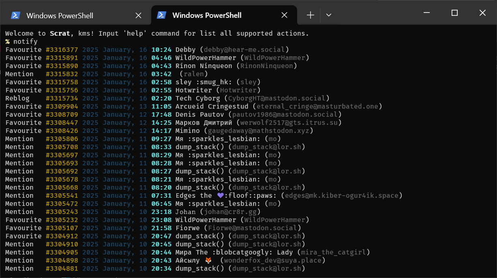
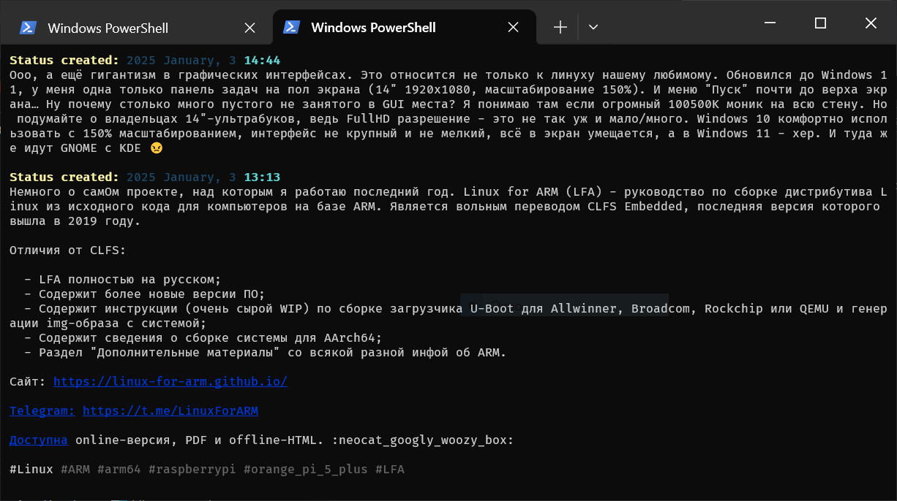

# Scrat

 | 

Scrat is a simple console Mastodon client written and Rust. Developing it as a hobby in freetime.

## Features

- Console interface without photos, videos and rainbow emojis;
- ...

## Technology stack

- **OS:** Windows, Linux (coming soon);
- **Programming language:** Rust;
- **User interface:** console pseudographic (by `cursive`);
<!-- - **Supported languages:** English, Russian (using `fluent`); -->

## Roadmap

- [ ] Secret storage;
- [ ] Main page;
- [ ] Notifications;
- [ ] User account;
- [ ] Search;
- [ ] Create post;

## License

Scrat is distributed under the MIT license.
